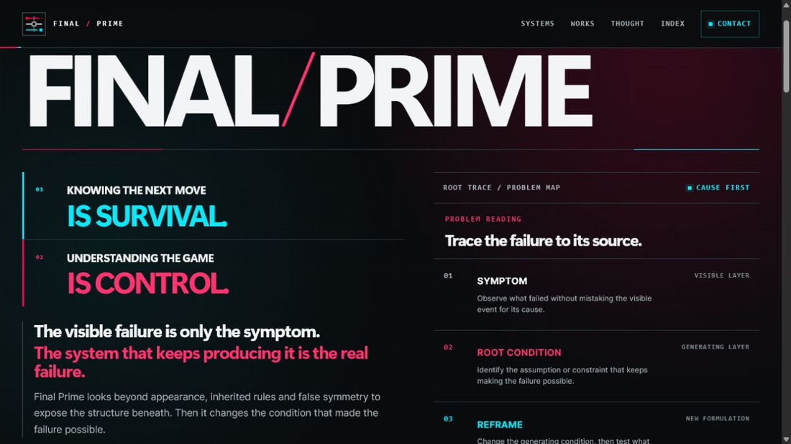
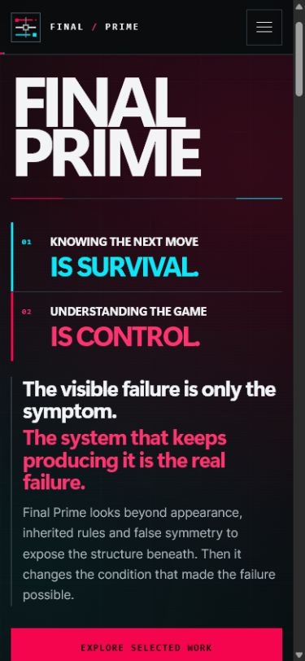

# Screenshot annotations

Date: 2026-07-17. All screenshots are first-viewport captures, not full-page reproductions. Benchmark pages are mutable and may differ when revisited. Automated counts support the visual audit but do not replace it; responsive duplicates, cookie dialogs, hidden preload states, and canvas content can distort DOM-derived word and element counts.

## Final Prime baseline

### Desktop - 1280×720



1. The motto and manifesto compete vertically with the wordmark instead of completing a single quick proposition.
2. The primary `Explore selected work` action begins at y=738, eighteen pixels below the viewport.
3. Root Trace is mostly visible, but it performs the same Surface → Trace → Origin → Reframe explanation that Method repeats later.
4. The small bottom metadata is also below the fold. The first screen therefore offers atmosphere and method but withholds the principal route.

### Mobile - 390×844



1. The desktop left column becomes a long opening chapter; the action group starts at y=802 and is only partly visible.
2. Root Trace starts at y=1190. It is not a right-side counterweight on mobile; it is a second chapter after the action.
3. The hierarchy is technically reflowed without horizontal overflow, but it is not reprioritised for the mobile task.

## Benchmark clusters

The full image set is in [`screenshots/benchmarks/`](screenshots/benchmarks/). Representative annotations:

- **Teenage Engineering / 100 Rabbits:** identity lives in one authored visual language; the interface shell is almost entirely unboxed.
- **Panic:** one real work item is made understandable with a short sentence and an organic visual field.
- **Ink & Switch:** the strongest structural analogue for Final Prime: concrete proof takes the larger field, while a short interpretation and two routes occupy the smaller field.
- **Low-tech Magazine:** content and evidence appear before institutional explanation; a small number of rules replaces card framing.
- **Anthropic:** a literal category proposition and a brief mission line precede a clearly bounded evidence area.
- **Palantir / Linear:** product UI is the counterweight; it does not explain the method a second time.
- **Vercel:** the right side is a compact orientation device. It qualifies the offer rather than competing with it.
- **Stripe:** literal proposition and CTA handle comprehension; the colour field handles atmosphere.
- **Midjourney / FIELD / Refik Anadol Studio:** mystery is safe because visible product or portfolio evidence and an explicit route coexist with the immersive surface.
- **Resn:** the extreme sparse case proves the risk boundary: a single route can orient the scene, but the category remains opaque.
- **Nothing:** the consent layer obscured both viewport captures; no first-impression conclusion is drawn from its underlying hero.
- **Active Theory:** DOM metrics were captured at both sizes, but the animated WebGL surface timed out twice during screenshot capture. It remains a partial audit rather than silently substituting a stale third-party image.

FIELD and Refik Anadol Studio returned mobile-dimension image buffers for the files labelled desktop even though their desktop DOM measurements reported 1440×900. Those two images are retained as visual references only; their desktop layout claims come from the measured matrix, not the mislabeled buffers.

## Cross-site annotation

Across the 18 sites, the transferable decision is about **role allocation**, not visual imitation:

```text
main proposition  +  [proof OR orientation]  ->  one obvious route
                         not another method
```

The experimental pages can afford greater ambiguity only when the right-hand or background surface is itself real work. Where proof is weak, negative space plus a literal orientation signal is safer than an invented dashboard, matrix, or diagram.
